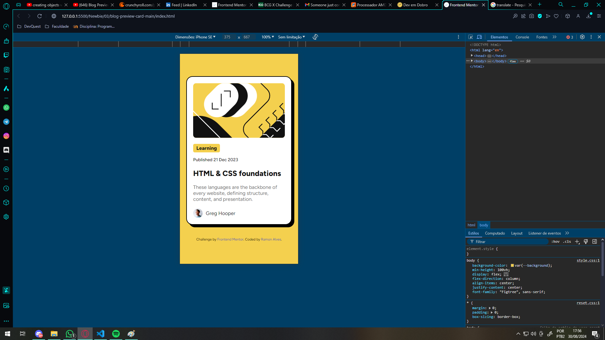

# Frontend Mentor - Social links profile solution

This is a solution to the [Blog preview card challenge on Frontend Mentor](https://www.frontendmentor.io/challenges/blog-preview-card-ckPaj01IcS). Frontend Mentor challenges help you improve your coding skills by building realistic proje

## Table of contents

- [Overview](#overview)
  - [The challenge](#the-challenge)
  - [Screenshots](#screenshots)
  - [Links](#links)
- [My process](#my-process)
  - [Built with](#built-with)
  - [What I learned](#what-i-learned)
- [Author](#author)

## Overview

This page is a Blog post preview card, this card contains:

- An illustration
- A content tag (post type)
- The post publication time
- A preview description
- The avatar of who made this post 

~~ Time spent: about 2 hours ~~

### The challenge

Users should be able to:

- See hover and focus states for all interactive elements on the page

### Screenshots

Here some pics of the solution

- Desktop (Normal)

- Desktop (Hover)

- Mobile (Normal)

- Mobile (Hover)

[Table of contents](#table-of-contents) - Click to return to the index "Table of contents"

### Links

- Solution URL: [FrontEnd Mentor](https://www.frontendmentor.io/solutions/-html5-e-css-3-newbie-blog-preview-card-TqO96YwLsz)
- Live Site URL: [Live Site](https://ramon-alvez.github.io/Frontend-Mentor-HTML-CSS-Newbie-Blog-preview-card/)

[Table of contents](#table-of-contents) - Click to return to the index "Table of contents"

## My process

Well, I made this project following some steps:

- HTML:
  - First, I analyzed the design and thought about the overall structure of the project;
  - Then, I structured the HTML, separating the divs, creating the main classes and formatting everything.

- CSS:
  - In CSS I started stylizing the main background and centering the card in the middle of the screen;
  - I configured the card parameters, color, border and the box shadow. I decided to use padding to give a standard spacing to the contents inside the card and a margin to maintain responsiveness, as the design
  - After that, it was just a matter of adjusting the fonts, color, and spacing of the card content. (and create the link hover :p)
  - For the avatar, I created a div with flex display to make the content horizontal, adjusted the spacing and size and the card was ready.

[Table of contents](#table-of-contents) - Click to return to the index "Table of contents"

### Built with

- Semantic HTML5 markup
- CSS custom properties
- Flexbox

[Table of contents](#table-of-contents) - Click to return to the index "Table of contents"

### What I learned

I learned how to create a shadow on an element, I really found this challenge really fun!

[Table of contents](#table-of-contents) - Click to return to the index "Table of contents"

## Author

- Github - [Ramon-Alvez](https://github.com/Ramon-Alvez)
- Frontend Mentor - [@Ramon-Alvez](https://www.frontendmentor.io/profile/Ramon-Alvez)
- LinkedIn - [@Ramon Alves](https://www.linkedin.com/in/ramon-alvez/)

** Note: My middle name is Alves, I just use the Z because its stylish =p (and LinkedIn dont allow me to use alves in my url :/)

[Table of contents](#table-of-contents) - Click to return to the index "Table of contents"
