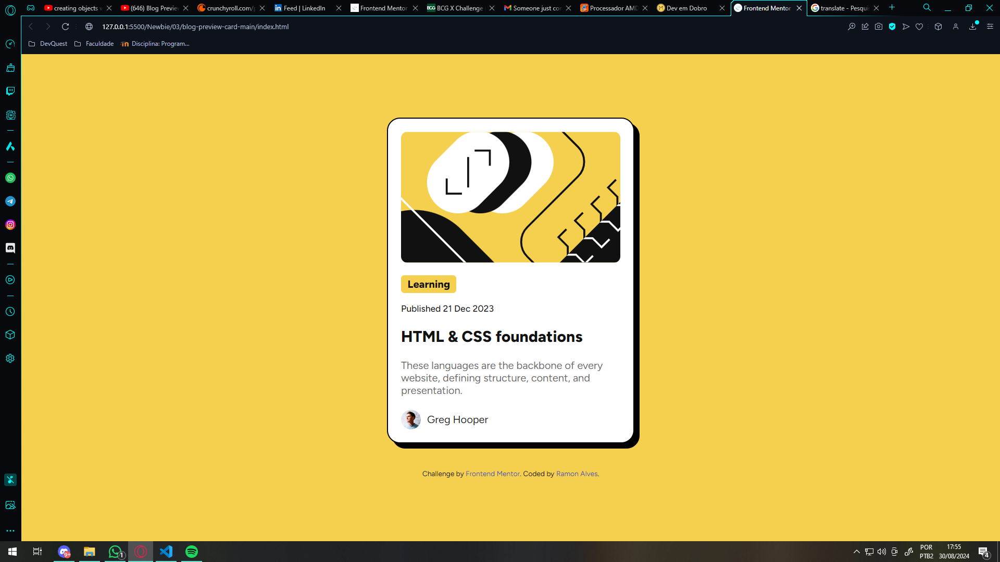
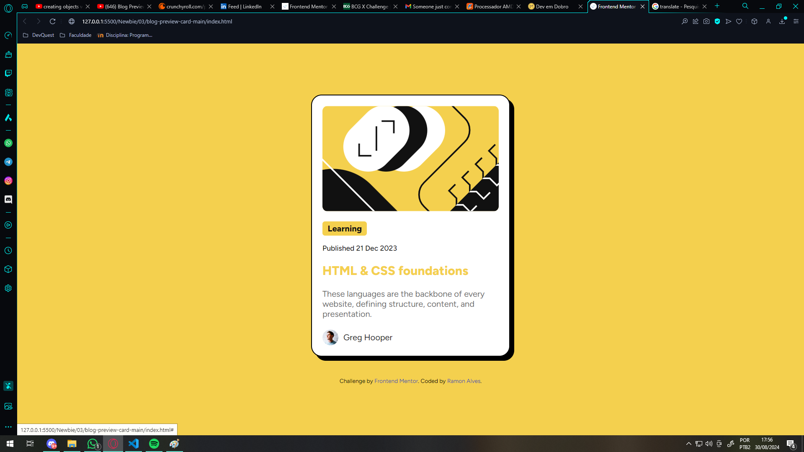
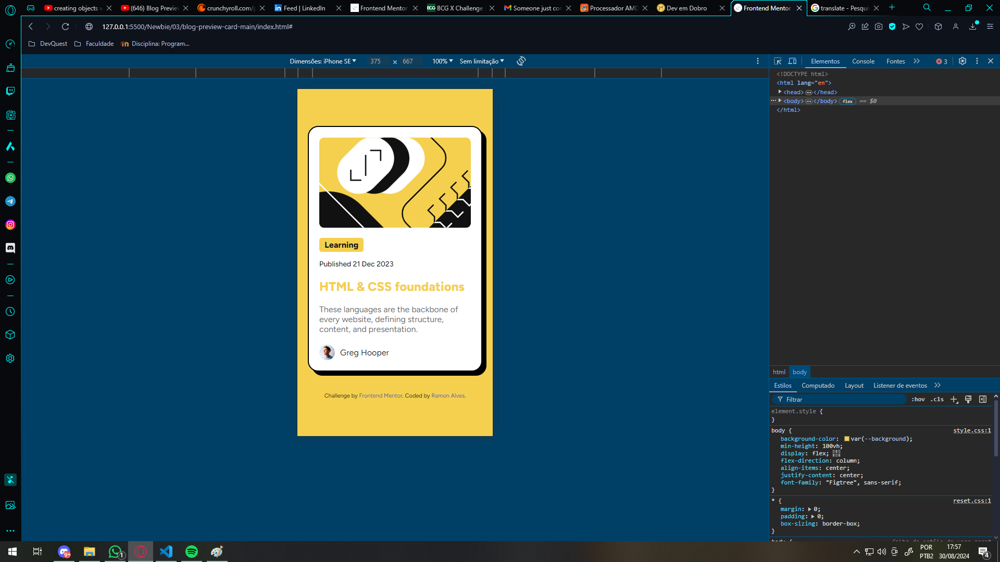

# Frontend Mentor | Solução Prévia de Blog

Esta é uma solução para o [Blog preview card challenge on Frontend Mentor](https://www.frontendmentor.io/challenges/blog-preview-card-ckPaj01IcS). Os desafios do Frontend Mentor ajudam você a melhorar suas habilidades de codificação através da construção de projetos realistas.

## Conteúdo

- [Resumo](#resumo)
  - [O desafio](#o-desafio)
  - [Prints](#prints)
  - [Links](#links)
- [Meu processo de resolução](#meu-processo-de-resolução)
  - [Feito com](#feito-com)
  - [O que aprendi](#o-que-aprendi)
- [Autor](#autor)

## Resumo

Esta página é um cartão de visualização da postagem do blog. Este cartão contém:

- Uma ilustração
- Uma tag de conteúdo (tipo de postagem)
- O tempo da publicação
- Uma descrição prévia
- O avatar de quem fez esta postagem 

~~ Tempo gasto: cerca de 2 horas ~~

### O desafio

Os usuários devem ser capazes de:

- Ver o efeito do hover e os estados de foco de todos os elementos interativos na página

### Prints

Aqui esta alguns prints da página

- Desktop (Normal)

- Desktop (Hover)

- Mobile (Normal)

- Mobile (Hover)

[Índice](#conteúdo) - Clique para voltar para o índice "Conteúdo"

### Links

- URL da Solução: [Add solution URL here](https://your-solution-url.com)
- URL do Live Site: [Add live site URL here](https://your-live-site-url.com)

[Índice](#conteúdo) - Clique para voltar para o índice "Conteúdo"

## Meu processo de resolução

Bom, eu fiz esse projeto seguindo os seguintes passos:

- HTML:
  - Primeiro, eu analizei o design e pensei em como ia ficar a estrutura geral do projeto;
  - Depois eu estruturei o HTML, separando as divs, criando as classes principais e formatando tudo.
  
- CSS:
  - Em CSS comecei estilizando o fundo principal e centralizando o cartão no meio da tela;
  - Configurei os parâmetros do cartão, cor, borda e sombra da caixa. Decidi usar padding para dar um espaçamento padrão ao conteúdo dentro do cartão e uma margem para manter a capacidade de resposta, já que o design
  - Depois disso, foi só ajustar a fonte, a cor e o espaçamento do conteúdo do cartão. (e crie o link hover :p)
  - Para o avatar, criei uma div com display flexível para deixar o conteúdo na horizontal, ajustei o espaçamento e tamanho e o cartão ficou pronto.

[Índice](#conteúdo) - Clique para voltar para o índice "Conteúdo"

### Feito com

- Marcação HTML5 semântica
- CSS 
- Flexbox

[Índice](#conteúdo) - Clique para voltar para o índice "Conteúdo"

### O que aprendi

Aprendi a criar uma sombra em um elemento, realmente achei esse desafio muito divertido!

[Índice](#conteúdo) - Clique para voltar para o índice "Conteúdo"

## Autor

- Github - [Ramon-Alvez](https://github.com/Ramon-Alvez)
- Frontend Mentor - [@Ramon-Alvez](https://www.frontendmentor.io/profile/Ramon-Alvez)
- LinkedIn - [@Ramon Alves](https://www.linkedin.com/in/ramon-alvez/)

** Nota: Meu nome do meio é Alves, Eu só uso o Z porque é legal =p (e porque o LinkedIn não deixa eu usar o Alves na minha url :/)

[Índice](#conteúdo) - Clique para voltar para o índice "Conteúdo"